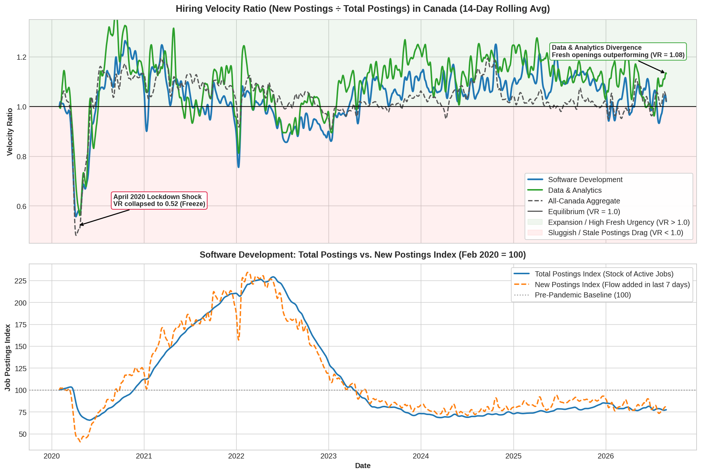
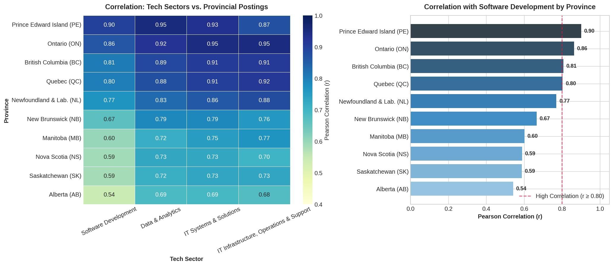

# First analysis: Canadian job-posting trends

Recorded: 2026-09-06. Data window: **2020-02-01 to 2026-08-28**.

This first step used posting indices to identify sectors and locations worth investigating for a software job search. It established market context; it did not yet measure accessible junior openings, salaries, required skills, or work stress. Personal planning notes remain local and are not published.

## Data and method

The notebooks identify the data as the Indeed Job Postings Index, with February 1, 2020 = 100. Pinned source URLs and checksums are now recorded in [the extraction manifest](data_extraction/sources.json).

| Local CSV | Coverage | Rows |
| --- | --- | ---: |
| [job_postings_by_sector_CA.csv](data/job_postings_by_sector_CA.csv) | 47 sectors; total and new posting indices | 225,694 |
| [metro_job_postings_CA.csv](data/metro_job_postings_CA.csv) | 45 metropolitan areas; overall posting index | 108,045 |
| [provincial_postings_ca.csv](data/provincial_postings_ca.csv) | 10 provinces; overall posting index | 24,010 |
| [aggregate_job_postings_CA.csv](data/aggregate_job_postings_CA.csv) | Canada; total/new indices, seasonally adjusted and unadjusted | 4,802 |

Workflow: **CSV files → parse dates → select sectors/locations → pivot daily series → smooth and compare → identify follow-up questions.**

- [data_analysis.ipynb](data_analysis/01_posting_indices/data_analysis.ipynb): compares four software/data/IT sectors, then extends the comparison to nine tech/STEM sectors. Uses a 7-day rolling mean for initial sector trends and 14-day means for stock/flow comparisons.
- The notebook joins national sector indices to provincial indices by date and calculates Pearson correlations on their levels over the full period.
- Its “velocity ratio” is `new posting index / total posting index`. The plotted 14-day ratio is the **mean of daily ratios**, not the ratio of the two 14-day means. The national comparison uses seasonally adjusted indices; sector adjustment is not specified in the local CSV.
- [metro_job_analysis.ipynb](data_analysis/01_posting_indices/metro_job_analysis.ipynb): ranks the latest metro indices, smooths nine selected metro trends over 14 days, finds 2020 minima and full-period maxima, calculates percentage decline from peak, and compares August 28, 2026 with August 28, 2025. Province boxplots group metro indices without weighting by market size.

## Findings

**Software postings remain below baseline.** On August 28, the total index was 77.14 for Software Development, 94.93 for Data & Analytics, 83.03 for IT Systems & Solutions, and 67.25 for IT Infrastructure, Operations & Support. Software was about 23% below its own 2020 baseline. These indices do not show which sector has the most openings.

**Electrical Engineering and Scientific R&D stand out in the broader comparison.** Values below use the last 14 days, ending August 28:

| Sector | Total index | New index | Mean daily ratio |
| --- | ---: | ---: | ---: |
| Electrical Engineering | 161.53 | 206.96 | 1.283 |
| Scientific Research & Development | 107.72 | 128.60 | 1.194 |
| Data & Analytics | 97.50 | 110.38 | 1.132 |
| IT Infrastructure, Operations & Support | 67.74 | 73.43 | 1.084 |
| IT Systems & Solutions | 84.07 | 89.60 | 1.066 |
| Project Management | 114.43 | 117.58 | 1.028 |
| Software Development | 77.32 | 78.88 | 1.020 |
| Mechanical Engineering | 138.31 | 137.51 | 0.995 |
| Industrial Engineering | 125.82 | 119.29 | 0.948 |

**Regional results differ.** Among the nine selected metros, Edmonton (138.22; +15.7% year over year) and Calgary (136.16; +12.3%) show stronger relative performance. Toronto (83.51; +0.1%) and Vancouver (77.27; +0.8%) changed little over the year. KWC fell 58.4% from its full-period peak to 79.98. These are all-sector metro results, not local software-job counts; near-flat annual change does not establish a market bottom.

**Provincial correlation describes shared movement.** National software postings correlate most strongly with PEI (0.90), Ontario (0.86), BC (0.81), and Quebec (0.80), versus Alberta (0.54). Shared pandemic trends can raise these correlations. They do not identify where software jobs are concentrated or establish cause.

## Plots created

Figures generated by [data_analysis.ipynb](data_analysis/01_posting_indices/data_analysis.ipynb) and [metro_job_analysis.ipynb](data_analysis/01_posting_indices/metro_job_analysis.ipynb) are automatically exported into `data_analysis/01_posting_indices/plots/`.

## Interpretation limits and next step

The notebooks describe new postings as listings from the preceding seven days. Because both series are indexed separately, a ratio above 1 means new postings have performed better relative to their baseline than total postings have. **It does not establish hiring urgency, net expansion, time to hire, or ghost postings.** The existing chart labels “equilibrium,” “freeze,” and “stale postings” are interpretations, not measured outcomes. The tracking plot's fixed Data & Analytics label of 1.08 is outdated; the latest 14-day calculation is 1.132.

Use this work to select markets for closer inspection: data roles, software roles within engineering/R&D, and opportunities in Alberta are candidates to test. Next, collect actual postings with consistent location and eligibility rules. Compare unique accessible openings, seniority, skills, and salary before choosing a job direction. Higher indices alone cannot establish a better entry-level market.

Verification for this summary: checked all four CSV row counts and date spans, independently recalculated the nine-sector table and software/province correlations, and inspected the three saved PNGs. Metro figures above come from stored notebook outputs; the notebooks were not rerun.

Repository setup check (2026-09-07): downloaded the four pinned CSVs into a clean temporary folder, executed all code cells from both notebooks with a non-interactive plotting backend, and regenerated all eight plots. No second-stage analysis was performed.
