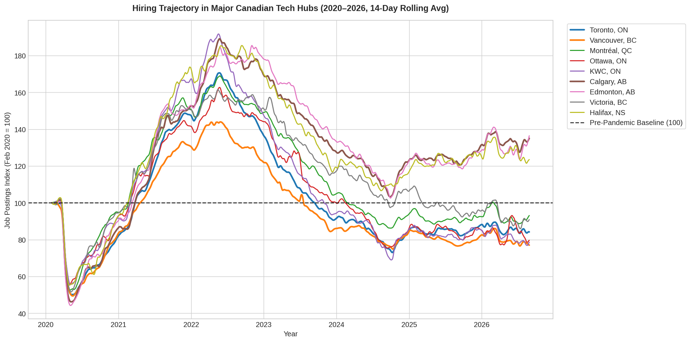
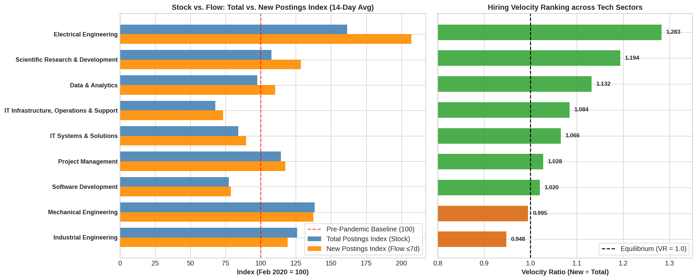

# Canada Job Market & Tech Postings Analysis (2020–2026)

[](https://www.python.org/)
[](https://opensource.org/licenses/MIT)

Empirical data analysis of labor demand, hiring velocity, and regional tech market co-movement across Canada covering **February 2020 through August 2026** (360,000+ data points across 47 industries and 45 metropolitan areas).

---

## 📌 Core Research Question
> *"Which software/tech job family and Canadian market offers the strongest combination of accessible openings, hiring velocity, and economic resilience?"*

---

## 🔍 Key Findings

### 1. The Regional Divergence: Alberta vs. Ontario & BC
* **Alberta and the Prairies** are currently the strongest labor markets in Canada (**Calgary: 136.2**, **Edmonton: 138.2**, **Lethbridge: 161.9** vs. Feb 2020 baseline of 100).
* **Core Tech Metros in Ontario and BC** suffered the deepest post-2022 hiring contractions: **Vancouver (77.3)**, **Ottawa (79.4)**, **Kitchener-Waterloo-Cambridge (80.0)**, and **Toronto (83.5)** sit in the **bottom 10 out of all 45 Canadian metropolitan areas**.



### 2. Hiring Velocity: Fresh Inflow vs. Stale Postings
By measuring the **Hiring Velocity Ratio** ($\text{VR} = \frac{\text{New Postings Index}}{\text{Total Postings Index}}$):
* **Data & Analytics ($\text{VR} = 1.132$, New Index = $102.8$)** is the #1 performing software/data discipline in Canada. Fresh job requisitions are entering above the pre-pandemic baseline.
* **Software Development ($\text{VR} = 1.020$, New Index = $72.6$)** has contracted into a sluggish inflow regime where existing postings linger longer on job boards before being replaced.
* **Electrical & STEM Engineering ($\text{VR} = 1.283$, Total Index = $160.8$)** shows surging industrial demand.


### 3. Sector Breakdown & Velocity Rankings
Comparing stock (total active listings) vs. flow (new listings added in the last 7 days):



### 4. Provincial Co-Movement with Tech Hiring
Correlations with national Software Development demand:
* **Ontario ($r = 0.863$)**, **British Columbia ($r = 0.807$)**, and **Quebec ($r = 0.803$)** have the strongest co-movement with the tech cycle.
* **Alberta ($r = 0.542$)** is largely decoupled, operating on an independent energy and engineering cycle.


---

## 📂 Repository Structure

```text
├── data_analysis.ipynb          # Sector trends, provincial correlation & velocity analysis
├── metro_job_analysis.ipynb     # 45 Canadian CMAs, tech hub trajectories & YoY growth
├── plots/                       # High-resolution exported figures
│   ├── hiring_velocity_tracking.png
│   ├── metro_tech_hubs_trajectory.png
│   ├── metro_top_bottom_rankings.png
│   ├── metro_yoy_growth.png
│   ├── metro_provincial_distribution.png
│   ├── tech_industry_velocity_comparison.png
│   ├── tech_province_correlation.png
│   └── tech_sectors_trends.png
├── ANALYSIS_SUMMARY.md          # Comprehensive data analysis notes & methodology
├── job_search.md                # Strategic 2-hour decision framework & hypotheses
├── requirements.txt             # Python dependencies
└── .gitignore                   # Excludes raw data dumps and environment files
```

---

## 📊 Data Note

Raw data files are deliberately excluded from this repository in accordance with open-data practices:
* The primary datasets derive from the **Indeed Hiring Lab Open Data Index** (February 2020 = 100).
* Complementary datasets include **Job Bank Canada Open Data** and **Statistics Canada Table 14-10-0444-01**.
* To run the notebooks, place the CSV files into a local `data/` directory.

---

## 🚀 Quickstart

### 1. Clone the repository
```bash
git clone https://github.com/althaafsn/canada-job-market-analysis.git
cd canada-job-market-analysis
```

### 2. Create a virtual environment & install dependencies
```bash
python3 -m venv .venv
source .venv/bin/activate
pip install -r requirements.txt
```

### 3. Register the Jupyter kernel & launch
```bash
python -m ipykernel install --user --name canada_job_analysis --display-name "Python (Job Analysis)"
jupyter lab  # or jupyter notebook
```
Open `data_analysis.ipynb` or `metro_job_analysis.ipynb` and select the **Python (Job Analysis)** kernel.

---

## 📄 License
This project is open-source under the [MIT License](LICENSE).
